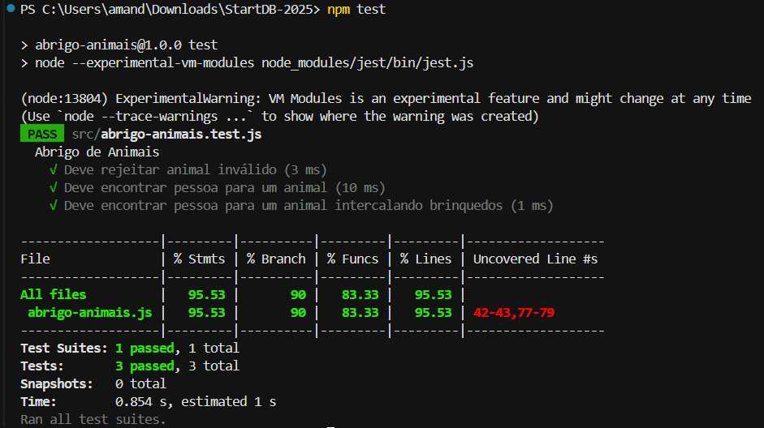

# Abrigo de Animais

Solução para o desafio técnico: decidir, para cada animal do abrigo, se ele vai para a **pessoa 1**, **pessoa 2** ou **permanece no abrigo**, seguindo regras específicas.
Minha implementação **passou em todos os testes automatizados** fornecidos.

---

## O que o sistema faz (explicado simples)

* Cada animal tem uma lista de **brinquedos favoritos em uma ordem específica**.
* Cada pessoa apresenta sua **lista de brinquedos**.
* O animal só é adotado se a pessoa conseguir mostrar **todos os brinquedos favoritos na mesma ordem** (podem existir outros brinquedos no meio).
* **Gatos** não “compartilham” um mesmo brinquedo (o mesmo **índice** da lista não serve para dois gatos).
* Se **as duas pessoas** podem adotar o mesmo animal, **ele fica no abrigo**.
* Cada pessoa pode adotar **no máximo três animais**.
* **Loco** (jabuti) **não liga para a ordem**, mas só vai para uma pessoa que **já tenha adotado outro animal**.

---

## Regras do desafio (resumo)

1. A ordem dos brinquedos favoritos **importa**.
2. Pode intercalar brinquedos **não favoritos**.
3. **Gatos** não dividem o **mesmo índice** de brinquedo.
4. Se **ambos** podem adotar, o animal fica **no abrigo**.
5. Cada pessoa pode adotar **no máximo 3** animais.
6. **Loco** não liga para a ordem, mas só vai se a pessoa **já tiver adotado** outro animal.

---

## Animais considerados

| Nome | Espécie | Brinquedos favoritos (na ordem) |
| ---- | ------- | ------------------------------- |
| Rex  | cão     | RATO, BOLA                      |
| Mimi | gato    | BOLA, LASER                     |
| Fofo | gato    | BOLA, RATO, LASER               |
| Zero | gato    | RATO, BOLA                      |
| Bola | cão     | CAIXA, NOVELO                   |
| Bebe | cão     | LASER, RATO, BOLA               |
| Loco | jabuti  | SKATE, RATO                     |

---

## Como rodar localmente

Pré-requisito: **Node.js 18+**

```bash
npm install
npm test
```

### Resultado dos testes

Print do terminal com “Test Suites: 1 passed”:

```



---

## Estrutura do projeto

```
.
└── src
    ├── abrigo-animais.js        # implementação (classe AbrigoAnimais)
    └── abrigo-animais.test.js   # testes (não alterei)
package.json
README.md
```
---

## Exemplos do enunciado

### Caso válido

Entrada:

```js
'RATO,BOLA', 'RATO,NOVELO', 'Rex,Fofo'
```

Saída:

```js
{ lista: ['Fofo - abrigo', 'Rex - pessoa 1'] }
```

### Caso inválido (animal desconhecido)

Entrada:

```js
'CAIXA,RATO', 'RATO,BOLA', 'Lulu'
```

Saída:

```js
{ erro: 'Animal inválido' }
```

---

## Como implementei (em termos práticos)

* **Preparação das entradas**: transformo as três strings em listas (separo por vírgula, removo espaços, coloco em maiúsculas).
* **Validações**: verifico se os animais existem e não estão repetidos; verifico se os brinquedos são válidos e sem duplicatas. Em caso de erro, retorno **“Animal inválido”** ou **“Brinquedo inválido”** exatamente como pedido.
* **Decisão animal a animal**:

  * Confiro se cada pessoa consegue “montar” a sequência de favoritos **na ordem**, permitindo itens no meio.
  * Para **gatos**, guardo os **índices já usados** para não repetir o mesmo índice com outro gato.
  * Aplico o **empate** (vai para o abrigo), o **limite de 3** por pessoa e a regra especial do **Loco**.
* **Saída final**: retorno a lista **ordenada alfabeticamente**, no formato **“Nome - pessoa 1|pessoa 2|abrigo”**.

---
